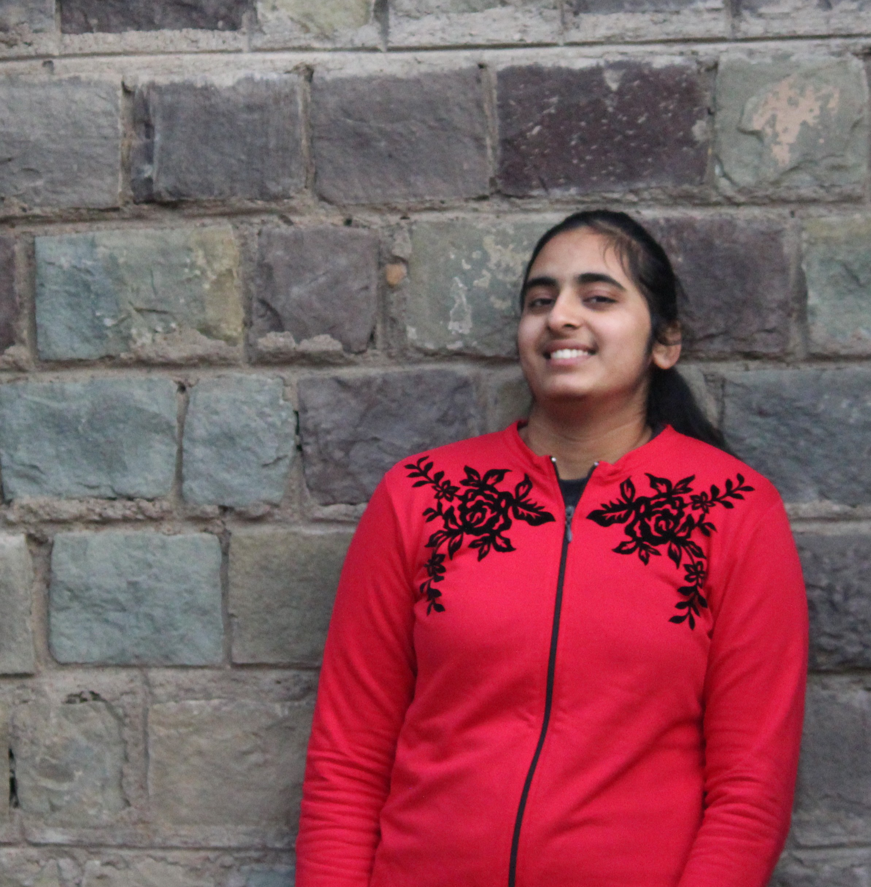

.. Personal Projects documentation master file, created by
   sphinx-quickstart on Wed May 13 16:06:58 2020.
   You can adapt this file completely to your liking, but it should at least
   contain the root `toctree` directive.

Welcome to Harnaman's Project-Space!
==========================================================

#############
**Know Me!**
#############

Hi! I am Harnaman Kaur. 

I am pursuing Bachelors of Technology (BTech) in Computer Science and Engineering from Indian Institute of Technology, Mandi.
I am a passionate learner. I love exploring varied domains of science and technology especially, computational computing.
I created this web-space to put together documentations for different projects that I have been working upon. 
Feel free to browse through!

**My Interests**

* Web Development

* Robotics

* Astronomy

* Photography

.. sidebar:: projects
      :subtitle: Chess
         Processing PGN Chess game files

.. toctree::
   :maxdepth: 3
   :caption: Contents on this page:

   modules

Indices and tables
==================

* :ref:`genindex`
* :ref:`modindex`
* :ref:`search`
