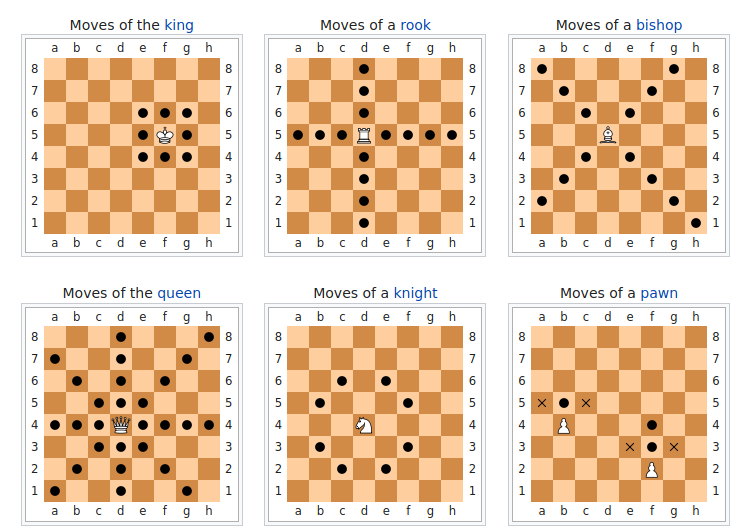

**Chess**
=========

.. image:: images/Chess_board_opening_staunton.jpg
   :align: right
   :width: 30%
   :height: 18em

.. _Chess top:

####################
**Project Details**
####################

The project aims to read and process ``.pgn`` files which contain the hierarchy of moves, along with the statistics of a game of Chess.
The program displays the status of the chess board after performing each move and the final position of pieces on the board after the game is over.
Any ``.pgn`` or ``.txt`` file can be given as an input to this program.

Read below about the game and associated notations, or proceed to the code documentation

.. toctree::
   :maxdepth: 4
   :caption: Modules:

   chess
   PgnParser
   pawn

####################
**About Chess**
####################

Chess is a two-player strategy board game played on a checkered board with 64 squares arranged in an 8×8 grid.
Play involves no hidden information. Each player begins with 16 pieces: one king, one queen, two rooks, two knights, two bishops, and eight pawns. Each piece type moves differently, with the most powerful being the queen and the least powerful the pawn. The objective is to checkmate the opponent's king by placing it under an inescapable threat of capture.
In addition to checkmate, a player wins the game if the opponent resigns, or, in a timed game, runs out of time. There are also several ways that a game can end in a draw. 

#########################
**Moves in a Chess Game**
#########################

+ The king moves one square in any direction. The king also has a special move called castling that involves also moving a rook. However, for a king to play a castling move, certain conditions must be met.

+ A rook can move any number of squares along a rank or file, but cannot leap over other pieces. Along with the king, a rook is involved during the king's castling move.

+ A bishop can move any number of squares diagonally, but cannot leap over other pieces.

+ The queen combines the power of a rook and bishop and can move any number of squares along a rank, file, or diagonal, but cannot leap over other pieces.

+ A knight moves to any of the closest squares that are not on the same rank, file, or diagonal. (Thus the move forms an "L"-shape: two squares vertically and one square horizontally, or two squares horizontally and one square vertically.) The knight is the only piece that can leap over other pieces.

+ A pawn can move forward to the unoccupied square immediately in front of it on the same file, or on its first move it can advance two squares along the same file, provided both squares are unoccupied (black dots in the diagram); or the pawn can capture an opponent's piece on a square diagonally in front of it on an adjacent file, by moving to that square (black "x"s). A pawn has two special moves: the en passant capture and promotion.

For more information on the game, visit `source <https://en.wikipedia.org/wiki/Chess>`_

Go to the top :ref:`Chess top`

#####################################
**The Portable Game Notation (PGN)**
#####################################

Portable Game Notation (PGN) is a plain text computer-processible format for recording chess games (both the moves and related data), supported by many chess programs. 
The chess moves themselves are given in algebraic chess notation. The usual filename extension is ``.pgn``.
PGN code begins with a set of "tag pairs" (a tag name and its value), followed by the "movetext" (chess moves with optional commentary). 

**A sample PGN file**
::

   [Event "F/S Return Match"]
   [Site "Belgrade, Serbia JUG"]
   [Date "1992.11.04"]
   [Round "29"]
   [White "Fischer, Robert J."]
   [Black "Spassky, Boris V."]
   [Result "1/2-1/2"]

   1. e4 e5 2. Nf3 Nc6 3. Bb5 a6 {This opening is called the Ruy Lopez.}
   4. Ba4 Nf6 5. O-O Be7 6. Re1 b5 7. Bb3 d6 8. c3 O-O 9. h3 Nb8 10. d4 Nbd7
   11. c4 c6 12. cxb5 axb5 13. Nc3 Bb7 14. Bg5 b4 15. Nb1 h6 16. Bh4 c5 17. dxe5
   Nxe4 18. Bxe7 Qxe7 19. exd6 Qf6 20. Nbd2 Nxd6 21. Nc4 Nxc4 22. Bxc4 Nb6
   23. Ne5 Rae8 24. Bxf7+ Rxf7 25. Nxf7 Rxe1+ 26. Qxe1 Kxf7 27. Qe3 Qg5 28. Qxg5
   hxg5 29. b3 Ke6 30. a3 Kd6 31. axb4 cxb4 32. Ra5 Nd5 33. f3 Bc8 34. Kf2 Bf5
   35. Ra7 g6 36. Ra6+ Kc5 37. Ke1 Nf4 38. g3 Nxh3 39. Kd2 Kb5 40. Rd6 Kc5 41. Ra6
   Nf2 42. g4 Bd3 43. Re6 1/2-1/2

To know more PGN notation, visit `PGN Wikipedia <https://en.wikipedia.org/wiki/Portable_Game_Notation>`_

To know more about Algebraic Chess Notation for chess moves, `click here <https://en.wikipedia.org/wiki/Algebraic_notation_(chess)>`_

Go to the top :ref:`Chess top`

